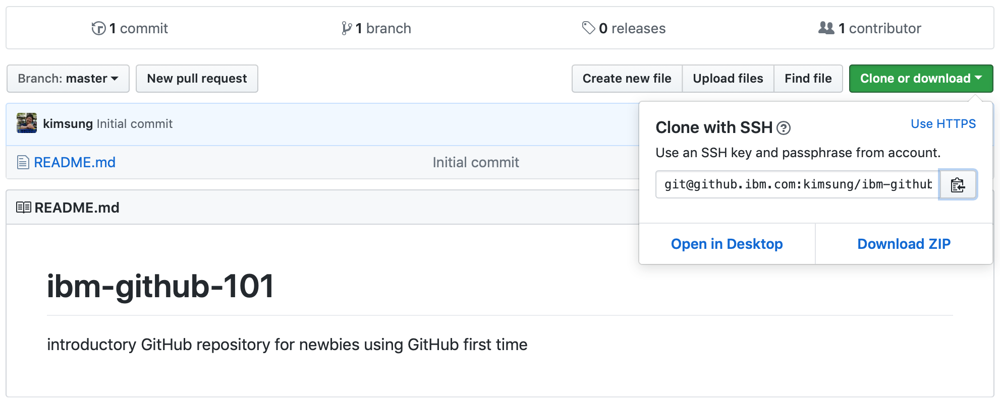

# Clone (Sync)

Download git repository into local machine

obtain the proper address (in HTTPS or SSH)



To clone the repositoy, type commands in terminal

```
git clone ADDRESS
```

## Modify/upload files

check status

```
git status
```

add new files

```
git add .
```

commit new changes

```
git commit -a
git commit -m "comment"
```

## Update remote repository

push changes into remote repository in github.ibm.com

```
git push
```


[up](../README.md)
