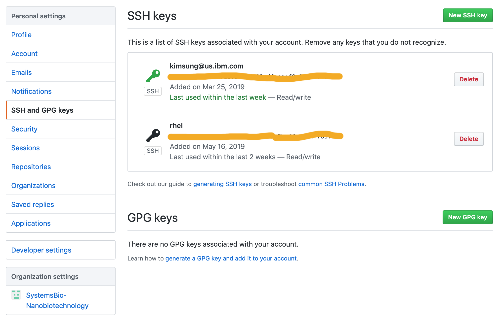
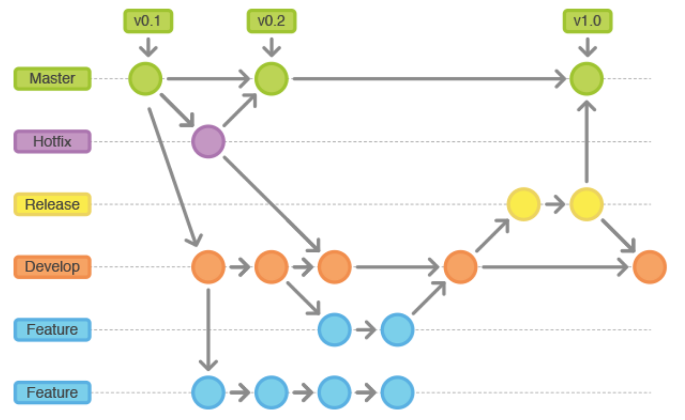

# Advanced topics

## Account setting (SSH key)



[Guide](https://help.github.com/en/enterprise/2.16/user/articles/connecting-to-github-with-ssh)

Modify ssh config file (`$HOME/.ssh/config`) in terminal

```
Host *
  ForwardAgent no
  ForwardX11 no
  ForwardX11Trusted yes
  ServerAliveInterval 60
  ServerAliveCountMax 30

Host github.ibm.com
    HostName github.ibm.com
    User IBMID
    IdentityFile ~/.ssh/id_rsa
    ControlMaster auto
```

Generate ssh key in local terminal 

```
$ ssh-keygen -t rsa -b 4096 -C "your_email@example.com"
```

Add new key into ssh system 

```
$ ssh-add -K ~/.ssh/id_rsa
```

Add new key to github website
```
$ pbcopy < ~/.ssh/id_rsa.pub
```

## Convert existing folder into github repository

[Adding an existing project to GitHub using the command line](https://help.github.com/en/articles/adding-an-existing-project-to-github-using-the-command-line)

1. Create a new repository on GitHub
1. `$ git init`
1. `$ git add .`
1. `$ git commit -m "First commit"`
1. `$ git remote add origin remote_repository_URL`
1. `$ git push -u origin master`

## Fork vs. Branch

[Forking vs. Branching in GitHub](https://stackoverflow.com/questions/3611256/forking-vs-branching-in-github)

`Forking`

Pros

- Keeps branches separated by user
- Reduces clutter in the primary repository
- Your team process reflects the external contributor process

Cons

- Makes it more difficult to see all of the branches that are active (or inactive, for that matter)
- Collaborating on a branch is trickier (the fork owner needs to add the person as a collaborator)
- You need to understand the concept of multiple remotes in Git
- Requires additional mental bookkeeping
- This will make the workflow more difficult for people who aren't super comfortable with Git

`Branching`

Pros

- Keeps all of the work being done around a project in one place
- All collaborators can push to the same branch to collaborate on it
- There's only one Git remote to deal with

Cons

- Branches that get abandoned can pile up more easily
- Your team contribution process doesn't match the external contributor process
- You need to add team members as contributors before they can branch



- [Gitflow Workflow, Automated Builds, Integration & Deployment](https://medium.com/devsondevs/gitflow-workflow-continuous-integration-continuous-delivery-7f4643abb64f)
- [5 types of Git workflow that will help you deliver better code](https://buddy.works/blog/5-types-of-git-workflows)
