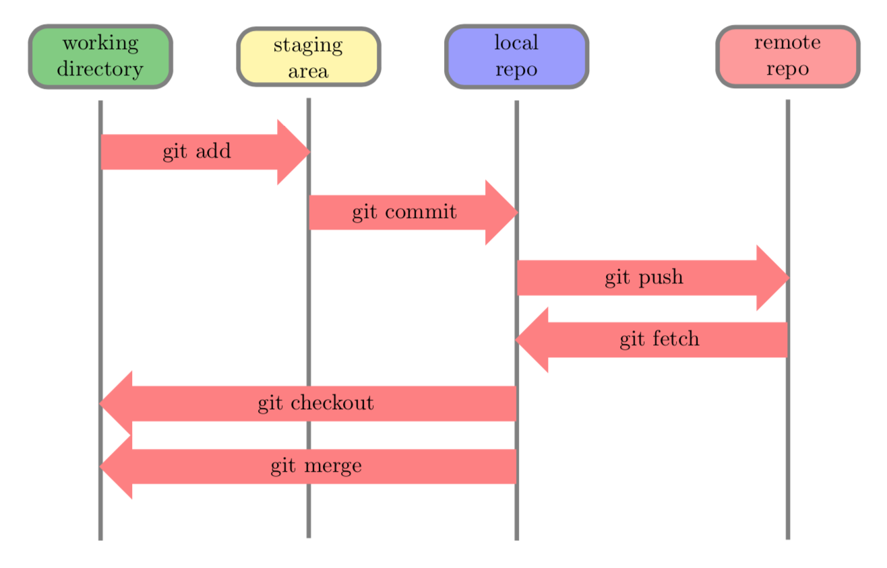

# IBM GitHub 101

Introductory GitHub repository for newbies using GitHub for the first time

## Key concepts

## Things to remember

## Development

[Gitflow Workflow, Automated Builds, Integration & Deployment](https://medium.com/devsondevs/gitflow-workflow-continuous-integration-continuous-delivery-7f4643abb64f)

## Work processes

1. [Create](./1-create/README.md)
1. [Update](./2-update/README.md)
1. [Advanced](./3-advanced/README.md)
1. [Others](./4-others/README.md)

## Useful links

[version-control](https://github.com/salimt/version-control)

